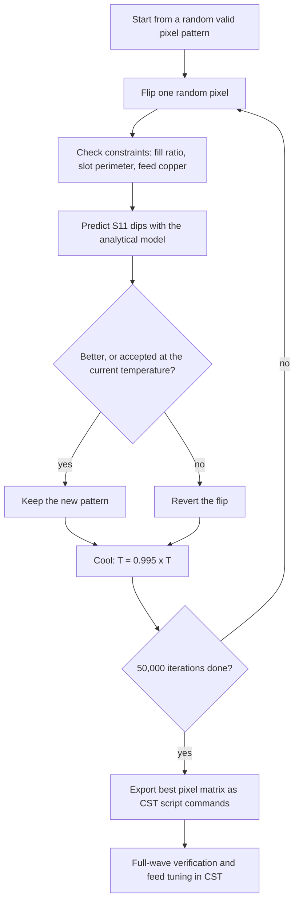

# Efficient Pixel Optimization for Multiband Microstrip Patch Antenna Design

A compact, low-cost multiband patch antenna whose radiating shape was **evolved by an algorithm I wrote in MATLAB**. Instead of drawing the antenna by hand or running a slow full-wave optimization, the algorithm searches tens of thousands of pixel patterns in minutes and hands the best one to CST Studio for full-wave verification. The result is a 60 × 60 mm antenna, 3.3 mm thin, on ordinary FR-4, with **nine resonances between 3.6 and 19 GHz**.


> **Status:** simulation only (CST Studio Suite 2025). The antenna has not been fabricated or measured.

## Why I built this

Multiband antennas are usually tuned by trial and error. A recent topology-optimization method (Ma et al., IEEE TAP, 2026) lets an optimizer decide where the copper goes, but it needs a three-layer aperture-coupled structure, an expensive low-loss substrate and roughly 120 hours of full-wave simulation.

I wanted to see how far I could get with cheap FR-4, a simpler stack-up, and a design loop measured in minutes instead of days.

## How the antenna was made

1. **Split the patch into pixels.** The radiating patch is an 8 × 12 grid of 5 mm × 5 mm pixels. Each pixel is either copper or air. Removing pixels cuts slots into the patch, which creates several current paths and therefore several resonant modes.
2. **Pick cheap, standard materials.** Two FR-4 substrates (εr = 4.3, tan δ = 0.02) instead of a high-cost low-loss laminate.
3. **Feed it without a ground-plane slot.** An L-shaped 50 Ω microstrip line sits between the two substrates and ends in a 3.8 × 2.5 mm rectangular coupling pad. It couples to the patch by proximity, so there is no aperture and no third layer.
4. **Let an algorithm design the pixel pattern.** I wrote a custom Pixel Optimization Algorithm in MATLAB (next section). It scores each pattern with closed-form models instead of running a full-wave simulation every iteration.
5. **Verify in CST.** The best pixel matrix is exported as CST script commands, imported into CST Studio Suite 2025, and checked with a full-wave simulation.
6. **Tune and evaluate.** The proximity feed is fine-tuned in CST, then S11, VSWR, gain, radiation patterns and surface currents are analysed.

## The Pixel Optimization Algorithm



| Setting | Value |
|---|---|
| Search space | 77 binary pixels (7 × 11) [CONFIRM: how this maps onto the 8 × 12 grid] |
| Move | Flip one random pixel |
| Acceptance | Better patterns always accepted; worse ones accepted with a probability that falls as the temperature cools |
| Initial temperature / cooling rate | 1000 / 0.995 per iteration |
| Maximum iterations | 50,000 |
| Hard constraints | Copper fill ratio between 35 % and 75 %; slot perimeter of at least 20 cell-edges; copper forced in the central feed region |
| Soft terms | Reward longer slot perimeter (more resonant modes) and symmetry (cleaner patterns); penalise disconnected pixels |
| Performance model | Resonant modes (TM10, TM01, meandering-path and slot modes) estimated from effective dimensions and fill ratio; Gaussian dips predict S11 depth at each target frequency |
| Runtime | 3–8 minutes on a standard laptop (optimization step only) |

The constraints keep the result manufacturable: no tiny floating copper islands and no almost-empty or almost-solid patches.

## Antenna structure

| Layer (top to bottom) | Thickness | Material |
|---|---|---|
| Pixelated patch | 0.07 mm | Copper |
| Substrate 2 | 1.6 mm | FR-4 (εr = 4.3, tan δ = 0.02) |
| L-shaped proximity feed | 0.035 mm | Copper |
| Substrate 1 | 1.6 mm | FR-4 (εr = 4.3, tan δ = 0.02) |
| Ground plane | 0.035 mm | Copper |

| Parameter | Value |
|---|---|
| Substrate and ground size | 60 × 60 mm |
| Pixel size | 5 × 5 mm |
| Feed line width / length | 3 mm / 14 mm |
| Coupling pad | 3.8 × 2.5 mm |
| Characteristic impedance | 50 Ω |
| Total height above ground | 3.305 mm |

## Results (CST simulation)

At a glance: S11 between −20.5 and −37.1 dB at nine resonances, VSWR between 1.03 and 1.21, gain between 0.06 and 4.39 dBi (peak at 12.47 GHz), radiation efficiency 19–37 %.


| # | Frequency (GHz) | S11 (dB) | VSWR | Gain (dBi) | Directivity (dBi) |
|---|---|---|---|---|---|
| 1 | 3.646 | −31.28 | 1.064 | 0.058 | 5.02 |
| 2 | 7.284 | −20.54 | 1.207 | 3.783 | 8.988 |
| 3 | 9.171 | −37.12 | 1.031 | 1.744 | 7.594 |
| 4 | 10.683 | −21.89 | 1.175 | 2.106 | 7.405 |
| 5 | 12.469 | −26.17 | 1.114 | 4.389 | 8.719 |
| 6 | 14.186 | −24.61 | 1.125 | 4.054 | 8.991 |
| 7 | 15.801 | −29.47 | 1.070 | 1.587 | 7.601 |
| 8 | 17.532 | −28.09 | 1.085 | 3.859 | 10.45 |
| 9 | 18.979 | −30.92 | 1.059 | 1.982 | 9.13 |

**−10 dB impedance bands**

| Band | From (GHz) | To (GHz) | Bandwidth |
|---|---|---|---|
| 1 | 3.565 | 3.761 | 195.8 MHz |
| 2 | 7.024 | 7.641 | 616.8 MHz |
| 3 | 8.917 | 9.529 | 611.6 MHz |
| 4 | 10.414 | 11.253 | 839.2 MHz |
| 5 | 11.700 | 12.944 | 1244 MHz (≈ 10 % fractional) |

The resonances fall in the 5G n78 band (3.6 GHz), C-band (about 7 GHz), X-band (9–11 GHz) and Ku/K-band (12–19 GHz).


The surface-current plots show why it works: at low frequencies the current follows the outer edges and large slots, and at higher frequencies it breaks into loops around the inner pixels and small slots. Each pixel pattern gives the patch several distinct current paths.

## Comparison with the reference design

| | Reference (Ma et al., IEEE TAP 2026) | This work |
|---|---|---|
| Substrate | F4BME220 (εr = 2.2), high cost | FR-4 (εr = 4.3), low cost |
| Structure | Three layers, aperture-coupled | Two substrates, proximity-coupled |
| Optimization | Full-wave GA, about 120 hours | Analytical model, 3–8 minutes, then CST verification |
| Coverage | Four bands, 2–7 GHz | Nine resonances, 3.6–19 GHz |
| Peak gain | Up to 8.02 dBi | 4.39 dBi |
| Efficiency | Above 78 % | 19–37 % |

The speed and cost gains come with a clear trade-off: the lossy FR-4 substrate costs gain and efficiency compared with the low-loss reference.

## Limitations

- **Simulation only.** No fabricated prototype or measurements yet.
- **Low efficiency.** Radiation efficiency is 19–37 % (−7.1 to −4.3 dB) because of the FR-4 loss tangent, which limits gain to 0.06–4.39 dBi.
- **Discrete resonances, not continuous coverage.** Nine resonances are analysed, and five −10 dB bands are tabulated.
- **Irregular patterns at higher bands.** The main beam tilts up to 28° (60° at 14.19 GHz), and above 7 GHz the side lobes sit only about 1–4 dB below the main lobe. The 3.65 GHz band is cleanest, with a side-lobe level of −12.1 dB.
- **The 3–8 minute figure covers the optimization step only.** The analytical model is an approximation, so CST verification and feed tuning are still needed afterwards.

## Future work

- Fabricate on FR-4 and measure S11, VSWR, gain and patterns
- Move to a low-loss Rogers RT/Duroid substrate to raise efficiency and gain
- Add PIN diodes or varactors for reconfigurable frequency or polarisation
- Miniaturise further with higher-permittivity substrates or extra slots
- Extend to 4- or 8-element MIMO arrays
- Test in real indoor and outdoor environments
- Try wearable or flexible substrates for body-centric and IoT use

## Repository structure

```
pixelated-multiband-patch-antenna/
├── README.md
├── matlab/       Pixel Optimization Algorithm scripts
├── images/       geometry and result plots used above
├── results/      exported S-parameters and gain data (CSV)
├── docs/         project report (PDF)
└── simulation/   small exported files; large CST projects go in Releases
```

## How to reproduce

1. Open MATLAB `[version]` and run `matlab/[main_script].m`.
2. The script generates the best pixel matrix and exports it as CST script commands.
3. In CST Studio Suite 2025, run the exported commands to build the pixelated patch, add the FR-4 stack-up and the L-shaped proximity feed, then solve with the transient solver over 2–20 GHz.

**Requirements:** MATLAB, CST Studio Suite 2025.

## Reference

X. Ma et al., "Design of Multiband Patch Antennas Using Adaptive Topology Optimization Method," *IEEE Transactions on Antennas and Propagation*, vol. 74, no. 1, pp. 38–50, Jan. 2026, doi: [10.1109/TAP.2025.3623329](https://doi.org/10.1109/TAP.2025.3623329).

## Author

**Daniel Pushparaj A**, M.E. Communication Systems, Francis Xavier College of Engineering, Tirunelveli

[Email](mailto:daniel202adpr@gmail.com) 

## License

[Add a license after confirming with your guide or college whether the work can be shared]
